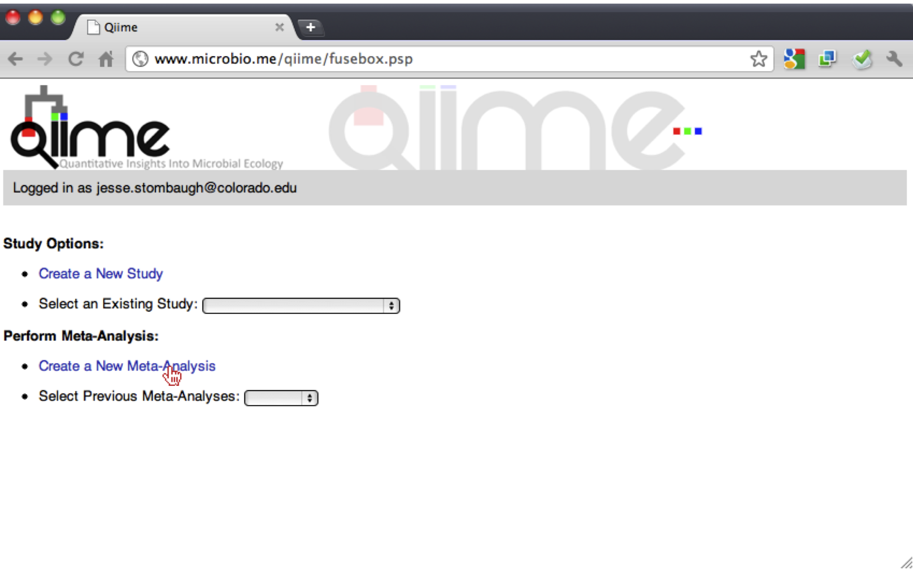
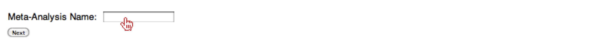

Create Meta-Analysis
--------------------

Now that a user would like to compare their samples with other samples in the database or if the user would just like to compare public samples in the datbase, they must first create a Meta-Analysis. The user should click on the "Create a New Meta-Analysis" link, which will redirect the user to a page containing a single input box.

First, you should type in a Meta-Analysis Name. Note: this name is a unique identifier for the user.

Then, the user should click the "Next" button, which will redirect the user to the Meta-Analysis frontpage.

.. image:: ../images/QWA_Create_MetaAnalysis_3.png
    :align: center
    :width: 600 px

Generate Sequences File, OTU Table and QIIME-Formatted Metadata File
---------------------------------------------------------------------

If the user was redirected to the main Meta-Analysis frontpage, then they can skip the next step.  If the user has already created their Meta-Analysis, they can generate a sequences file (FASTA), OTU table, and QIIME-Formatted mapping file by selecting a Meta-Analysis from the select box for "Select Previous Meta-Analysis" on the "Select Task" home page, which will redirect the user to the Meta-Analysis frontpage.

.. image:: ../images/QWA_Generate_OTU_1.png
    :align: center
    :width: 600 px

Next, the user should click on the link "Generate OTU table and metadata file"????, which will redirect the user to the sample selection page.

.. image:: ../images/QWA_Generate_OTU_2.png
    :align: center
    :width: 600 px

On the sample selection page, the user should first give a filename prefix to the files they will produce.  You should also, specify the taxonomic assignment that you would like to be represented in the OTU table. 

.. image:: ../images/QWA_Generate_OTU_3.png
    :align: center
    :width: 600 px

You can select the fields you would like outputted by selecting a field in the left select-box and either double-clicking that field or clicking on the ">" button to move it to the right select-box.

.. image:: ../images/QWA_Generate_OTU_4.png
    :align: center
    :width: 600 px

When the user selects a field in the left select-box they should notice a gray table appear below which gives information about that particular field, however; when they select a field in the right select-box, they will see an additional column containing values found for that particular field.  From the Values box, the user should select values that correspond to the types of samples they would like to compare.  If no values are selected, then all samples will be taken.

.. image:: ../images/QWA_Generate_OTU_5.png
    :align: center
    :width: 600 px

If the user would like to reduce the number of fields and select samples based on specific fields, they can select one of the categories for the fields (e.g. Study, package-specific, etc.).

