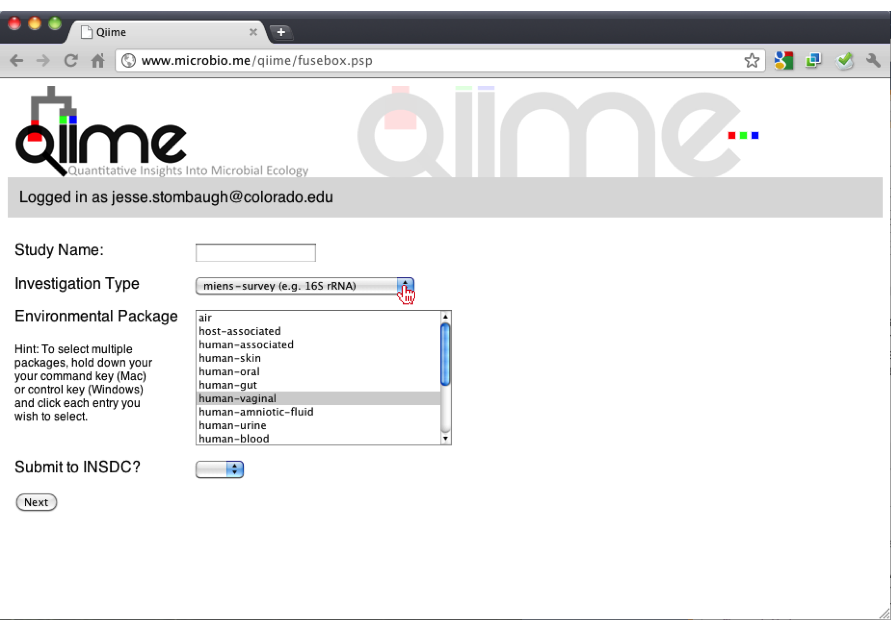
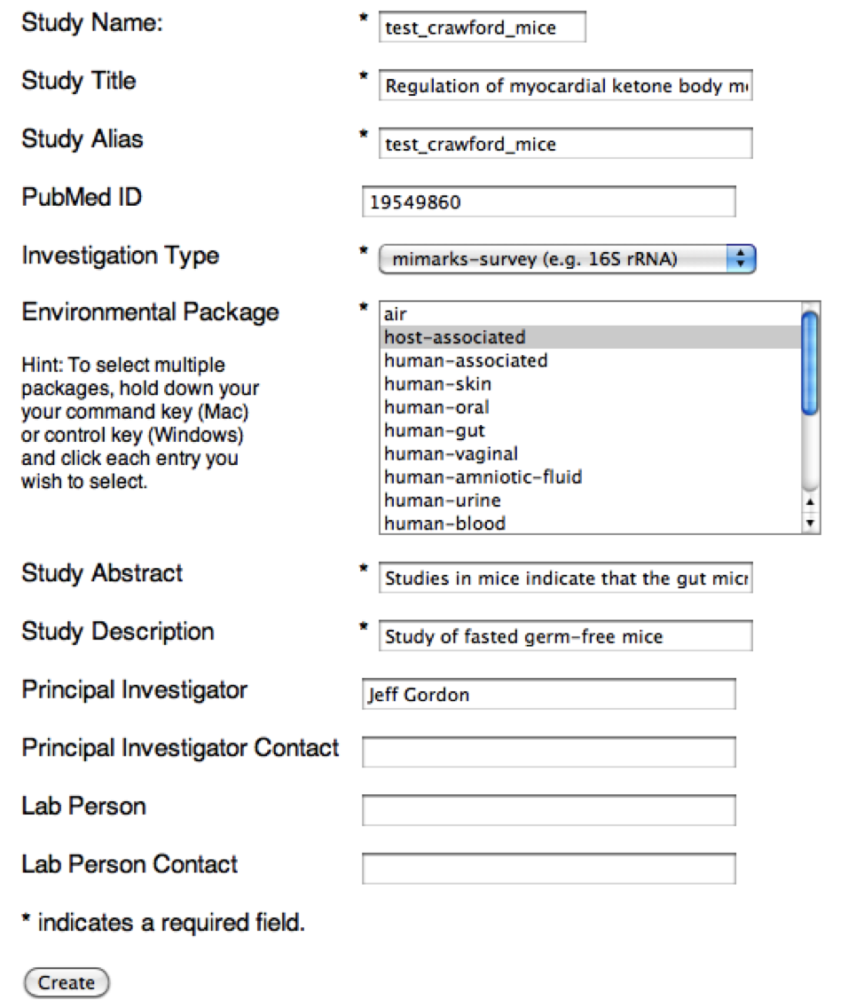
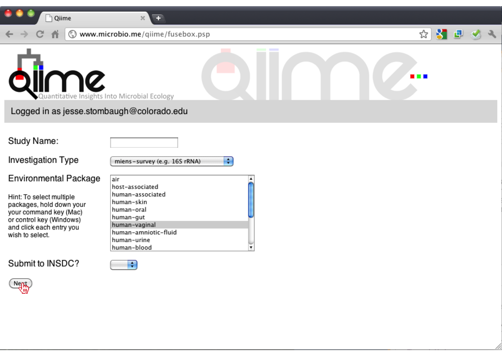
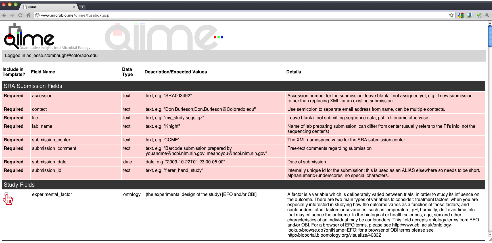
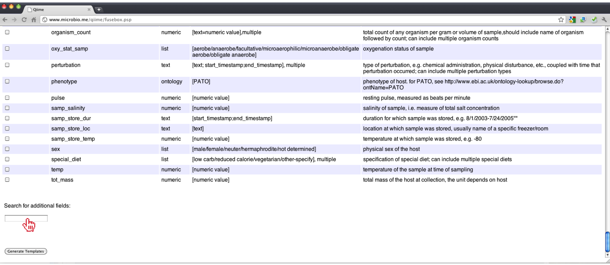
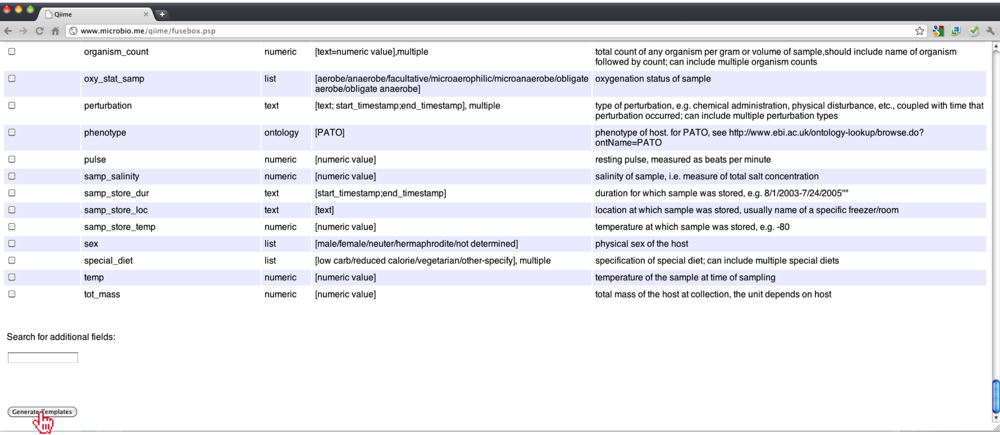
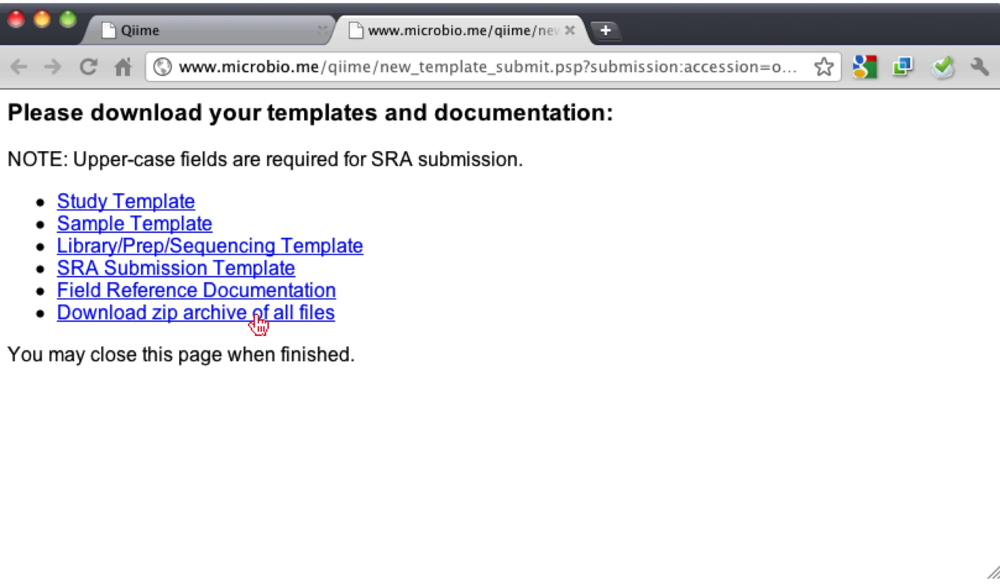
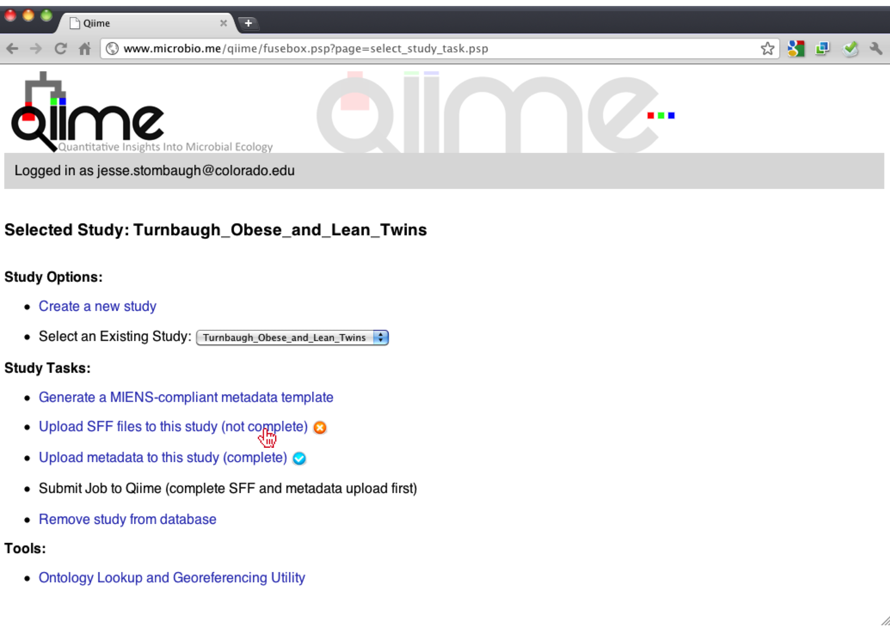
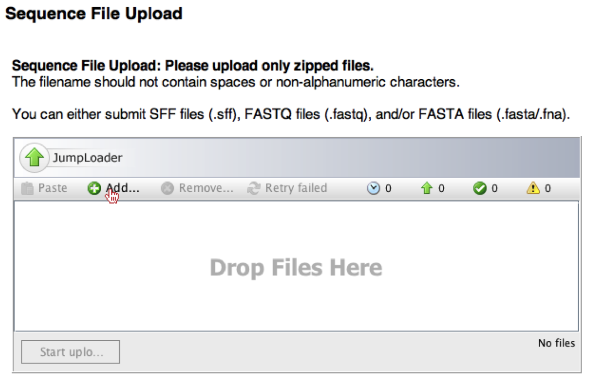

.. _tutorial:

======================================
QIIME Web-Interface Overview Tutorial
======================================

Introduction
-------------
This tutorial explains how to use the **QIIME** (Quantitative Insights Into Microbial Ecology) Web-Interface to process data from high-throughput 16S rRNA sequencing studies. The purpose of this tutorial is to provide a start-to-finish workflow, beginning with the creation of a study, uploading the corresponding SFF and MIENs-compliant metadata through generating a composite list of sequences, OTU table, and QIIME-formatted mapping file. With this information in hand, it is possible to determine biological and environmental factors that alter microbial community ecology in your experiment in comparison to other experiments.

As an example, we will not use data from a study of the response of mouse gut microbial communities to fasting (Crawford et al., 2009). At the end of our tutorial, we will be able to compare the community structure of control vs. fasted animals. In particular, we will be able to compare taxonomic profiles for each sample type, differences in diversity metrics within the samples and between the groups, and perform comparative clustering analysis to look for overall differences in the samples.

To load and process our data, we will perform the following steps:

* Create a unique study for our dataset
* Generate MIENs-compliant metadata templates
* Use the Ontology Lookup and GeoReferencing Tool for filling in Ontology specific metadata fields
* Upload MIENs-compliant metadata and corresponding SFF files
* Create a meta-analysis
* Select and generate Sequences file, OTU table and QIIME-formatted metadata file.

Essential Files
-----------------

MIENs-Compliant Metadata Files (.xls or .txt)
^^^^^^^^^^^^^^^^^^^^^^^^^^^^^^^^^^^^^^^^^^^^^^^^^^^^^^^^^^^^^^^^^^^^^^^^^
These are the tab-delimited templates generated using the QIIME Web-Interface, once you have created a unique study for your experiment and identified the type of study (i.e., host-associated, human-gut, human-oral, etc.).

Flowgram File (.sff)
^^^^^^^^^^^^^^^^^^^^^^^^^^^^^^^^^^^^^^^^^^^^^^^^^^^^^^^^^^^^^^^^^^^^^^^^^
This is the 454-machine generated file which stores the sequencing trace data. This is the largest file returned from a 454 run.

Create a Study
---------------
Once the user has logged in, we can create a study, by clicking on the link "Create a New Study".  For the QIIME Web-Interface, a study is classified as one or more sequencing runs that are part of the same study, which means there will be one set of MIENS-compliant templates for one or more Sequencing Runs (SFFs).

.. image:: ../images/QWA_New_Study_1.png
    :align: center
    :width: 600 px
    
Once redirected to the new study page, the user must create a unique Study Name.  The Study Name is unique to the database, not just to an individual's account, which means that if you type "mice" it is most likely someone else has used that study name. Therefore you will want to create a unique study name, such as the combination of the first author's last name and the type of study (e.g. Turnbaugh_Obese_and_Lean_Twins).

.. image:: ../images/QWA_New_Study_2.png
    :align: center
    :width: 600 px
    
Once a Study Name has been defined, the user must select the Investigation Type for their study (i.e. miens-survey, metagenome, virus, etc.), however; most commonly users will be submitting a 16S rRNA miens-survey.

Along with the Investigation Type, the user must select one or multiple environmental packages that their study comprises. These fields determine which MIENs fields are required for submission of the study.

.. image:: ../images/QWA_New_Study_4.png
    :align: center
    :width: 600 px

Finally, the user must select whether this study has or will be submitted to The International Nucleotide Sequence Database Collaboration (INSDC).

    
Once all the fields have been filled out, the user must click the "Next" button.

Generate MIENs-Compliant Templates
----------------------------------
To create the MIENs-compliant templates the user should select the link "Generate a MIENs-compliant metadata template".

On the next page, the user will be presented with a large HTML table, which lists all the appropriate MIENs-compliant fields.  Rows with the Pink background denote fields that are required (either by MIENs or depending on the package(s) corresponding to this study).  If the user has other information pertaining to their study and the field is not required, the user can select specific columns, to add to their templates, by clicking on the checkbox next to the left of each field.  We recommend that you select all fields that apply, since the more information you put into these templates, the more useful the data becomes, when inserted into the database.

If there is a field that the user thinks may be in the database, but they do not see it in the table, they can start typing the word(s) in the input box at the bottom of the page.  This will search the database and show other fields that are present, using auto-complete functionality.  If you cannot find a field, then we recommend you add the column to your sample template and it will be parsed and added to the database.

Once you have checked all the fields that apply, you can click the "Generate Templates" button.

Once you have clicked "Generate Templates", you will be redirected to another page, where you can download the templates by clicking "Download zip archives of all files".

    
Ontology Lookup and Georeferencing Tool
---------------------------------------

.. image:: ../images/QWA_Ontology_Geo_1.png
    :align: center
    :width: 600 px
    
Upload MIENs-Compliant Templates 
-----------------------------------------

Upload SFFs
------------

.. image:: ../images/QWA_Upload_SFF_3.png
    :align: center
    :width: 600 px

Create Meta-Analysis
--------------------

Generate Sequences File, OTU Table and QIIME-Formatted Metadata File
---------------------------------------------------------------------

References
------------
Crawford, P. A., Crowley, J. R., Sambandam, N., Muegge, B. D., Costello, E. K., Hamady, M., et al. (2009). Regulation of myocardial ketone body metabolism by the gut microbiota during nutrient deprivation. Proc Natl Acad Sci U S A, 106(27), 11276-11281.

.. _Cytoscape: http://www.cytoscape.org/
.. _PyNAST: http://pynast.sourceforge.net/
.. _Unifrac: http://bmf2.colorado.edu/unifrac/index.psp
