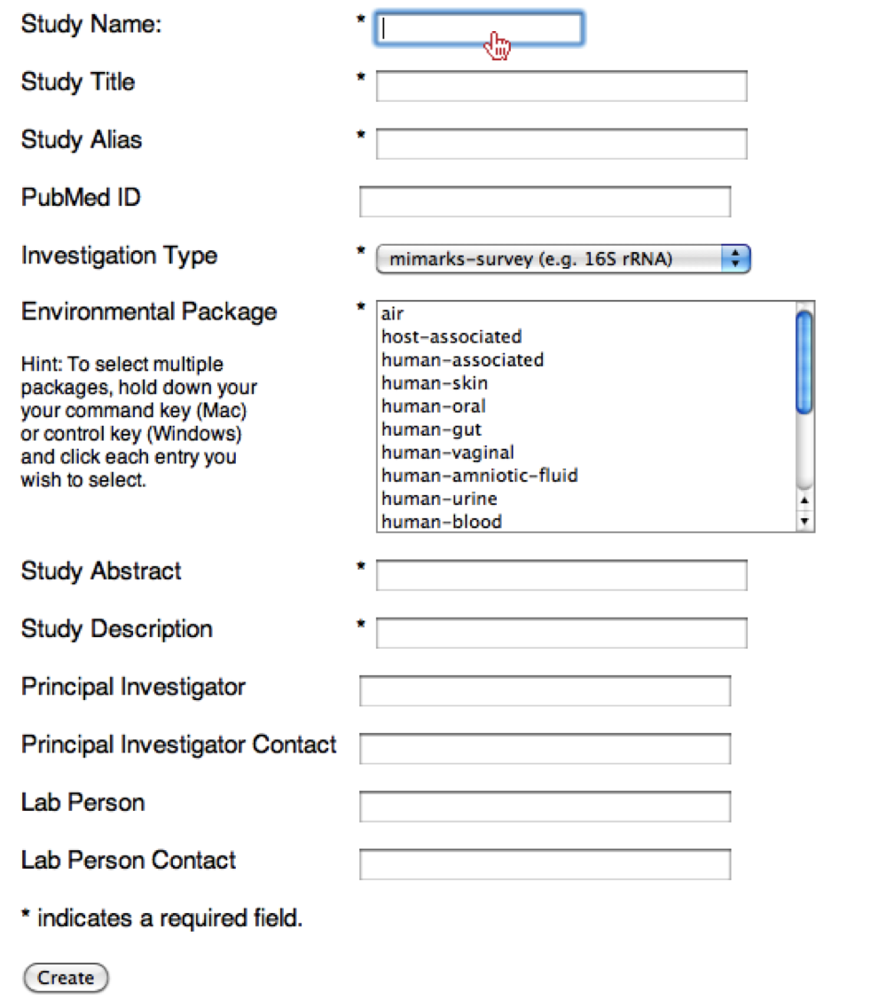
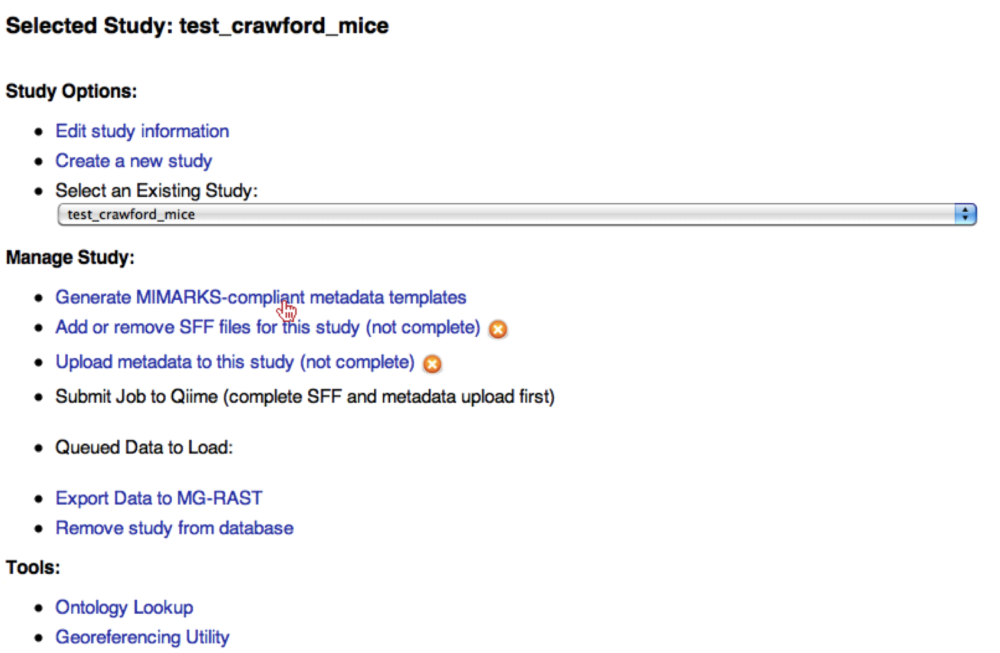
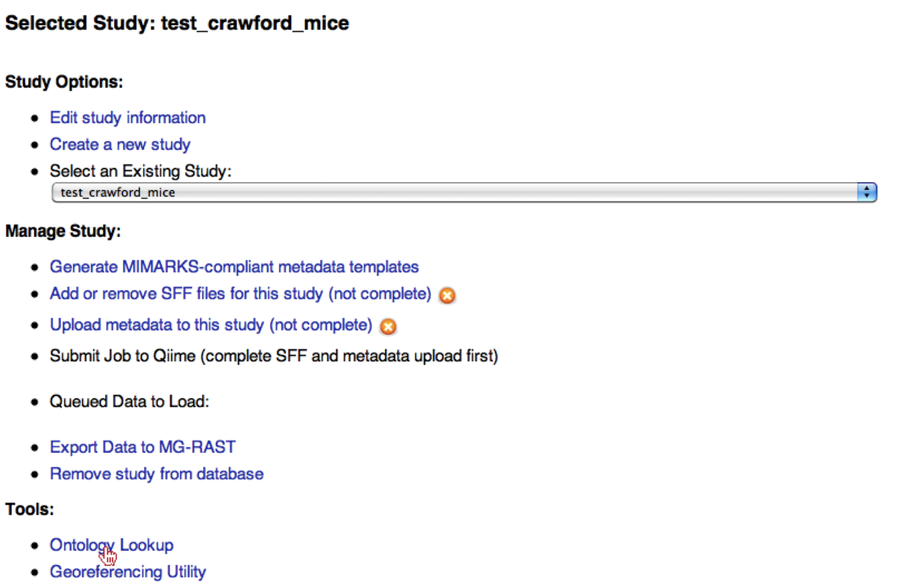
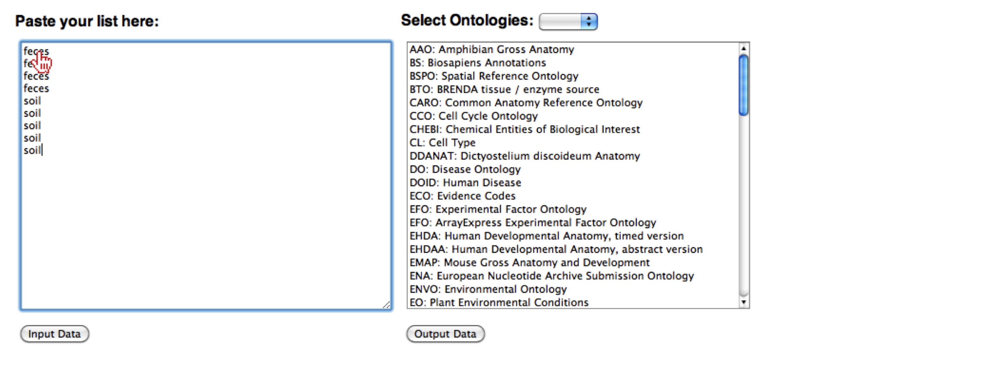
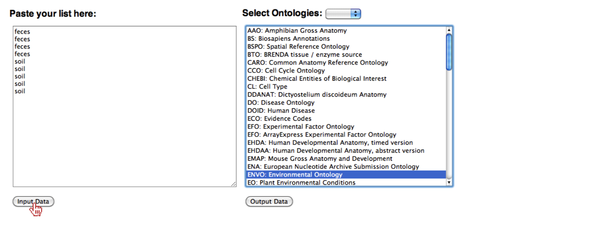
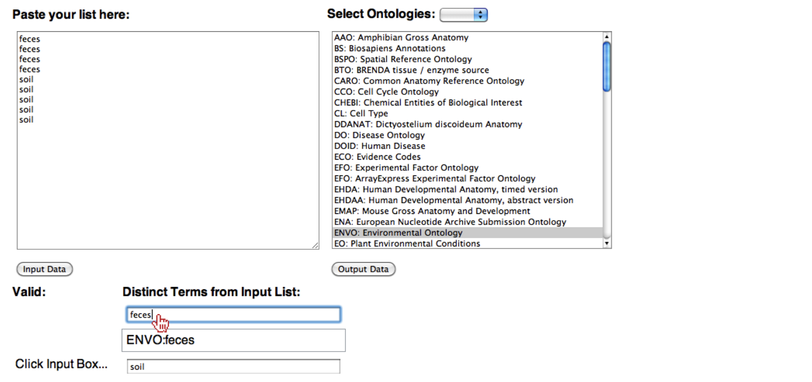
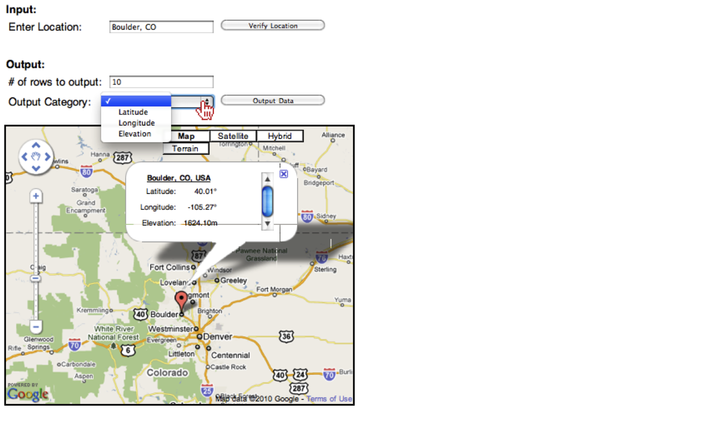
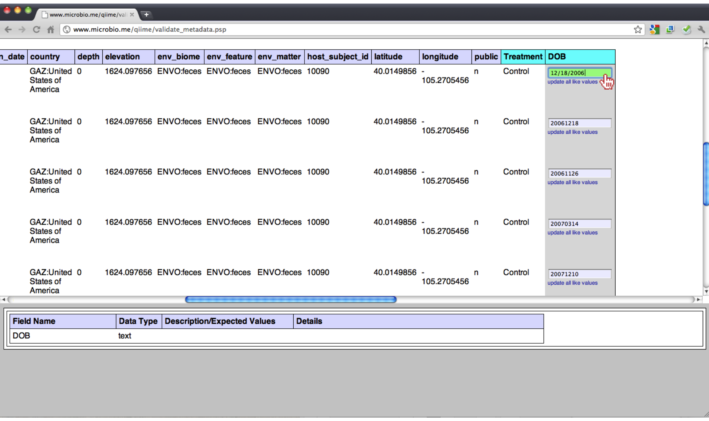
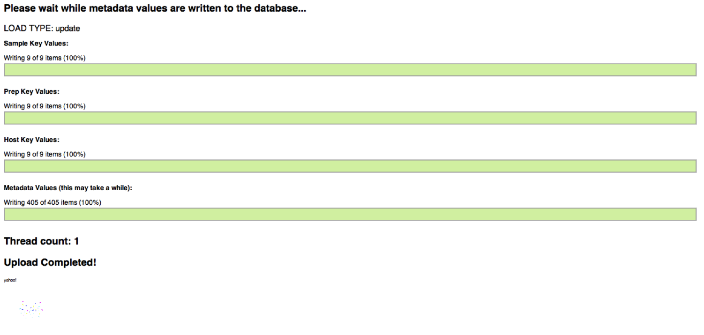
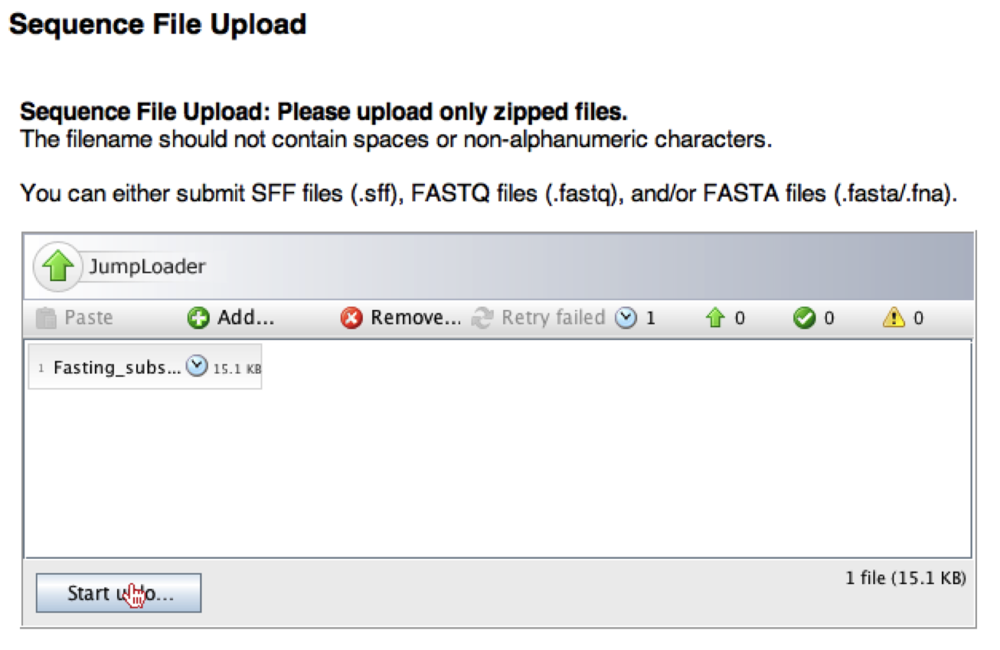

.. _tutorial:

=====================================================
Create Study and Generate MIMARKS-compliant Metadata
=====================================================

Introduction
-------------
This tutorial explains how to use the **QIIME** (Quantitative Insights Into Microbial Ecology) Web-Interface to generate MIMARKS-compliant metadata and submission to the QIIME Database. With this information in hand, it is possible to determine biological and environmental factors that alter microbial community ecology in your experiment in comparison to other experiments.

As an example, we will use data from a study of the response of mouse gut microbial communities to fasting (Crawford et al., 2009), which can be downloaded `here <../crawford_mice_qiime_web_tutorial.zip>`_. This folder contains the original paper and a QIIME-formatted mapping file containing the samples and some key information pertaining to those samples. At the end of our tutorial, we will be able to compare the community structure of control vs. fasted animals. In particular, we will be able to compare taxonomic profiles for each sample type, differences in diversity metrics within the samples and between the groups, and perform comparative clustering analysis to look for overall differences in the samples.

To load and process our data, we will perform the following steps:

* Create a unique study for our dataset
* Generate MIMARKS-compliant metadata templates
* Use the Ontology Lookup and GeoReferencing Tool for filling in Ontology specific metadata fields
* Upload MIMARKS-compliant metadata and corresponding SFF files

Essential Files
-----------------

MIMARKS-Compliant Metadata Files (.xls or .txt)
^^^^^^^^^^^^^^^^^^^^^^^^^^^^^^^^^^^^^^^^^^^^^^^^^^^^^^^^^^^^^^^^^^^^^^^^^
These are the tab-delimited templates generated using the QIIME Web-Interface, once you have created a unique study for your experiment and identified the type of study (i.e., host-associated, human-gut, human-oral, etc.).

Sequence Files (FASTA, FASTQ, or SFF)
^^^^^^^^^^^^^^^^^^^^^^^^^^^^^^^^^^^^^^^^^^^^^^^^^^^^^^^^^^^^^^^^^^^^^^^^^
The QIIME-DB can process 3 types of sequence files:
    #. **FASTA**: The specific format of these file expected is the post-split-libraries FASTA-format. For more information pertaining to this format, please refer to `here <http://qiime.org/documentation/file_formats.html#demultiplexed-sequences>`_. Each FASTA file should be zipped using the "zip" tool prior to uploading.
    #. **FASTQ**: The QIIME-DB can only handle FASTQ files produced from Illumina's HiSeq/MiSeq technologies, therefore there should be 1 sequence file and 1 barcode file. Each FASTQ file should be gzipped with the "gzip" tool, prior to uploading.
    #. **SFF**: These are binary files produced from Roche's 454 FLX and Titanium chemistries. For the Titanium SFFs, they will be trimmed to FLX length prior to loading into the DB. Each SFF should be zipped using the "zip" tool prior to uploading.

Create a Study
---------------
Once the user has logged in, we can create a study, by clicking on the link "Create a New Study".  For the QIIME Web-Interface, a study is classified as one or more sequencing runs which comprise an experimental hypothesis, which means there will be one set of MIMARKS-compliant templates for one or more sequencing runs to address the hypothesis.

.. image:: ../images/QWA_New_Study_1.png
    :align: center
    :width: 600 px
    
Once redirected to the new study page, the user must create a unique Study Name.  The Study Name is unique to the database, not just to an individual's account, which means that if you type "mice" it is most likely someone else has used that study name. Therefore you will want to create a unique study name, such as the combination of the first author's last name and the type of study (e.g. Turnbaugh_Obese_and_Lean_Twins). Along with Study Name, the user should supply the Study Title, an Alias for easy lookup and a Pubmed ID (if applicable).

    
Once the Study information has been defined, the user must select the Investigation Type for their study (i.e. MIMARKS-survey, metagenome, virus, etc.), however; most commonly users will be submitting a 16S rRNA MIMARKS-survey.

.. image:: ../images/QWA_New_Study_3.png
    :align: center
    :width: 400 px

Along with the Investigation Type, the user must select one or multiple environmental packages that their study comprises. These fields determine which MIMARKS fields are required for submission of the study.

.. image:: ../images/QWA_New_Study_4.png
    :align: center
    :width: 400 px
    
Once all the fields have been filled out, the user must click the "Create" button.

.. image:: ../images/QWA_New_Study_5.png
    :align: center
    :width: 400 px

Generate MIMARKS-Compliant Templates
----------------------------------------
To create the MIMARKS-compliant templates the user should select the link "Generate MIMARKS-compliant metadata templates".

On the next page, the user will be presented with a large HTML table, which lists all the appropriate MIMARKS-compliant fields.  Rows with the Pink background denote fields that are required (either by MIMARKS or depending on the package(s) corresponding to this study).  If the user has other information pertaining to their study and the field is not required, the user can select specific columns, to add to their templates, by clicking on the checkbox next to the left of each field.  We recommend that you select all fields that apply, since the more information you put into these templates, the more useful the data becomes, when inserted into the database.

.. image:: ../images/QWA_Generate_MIMARKS_2.png
    :align: center
    :width: 700 px

If there is a field that the user thinks may be in the database, but they do not see it in the table, they can start typing the word(s) in the input box at the bottom of the page.  This will search the database and show other fields that are present, using auto-complete functionality.  If you cannot find a field, then we recommend you add the column to your sample template and it will be parsed and added to the database.

.. image:: ../images/QWA_Generate_MIMARKS_3.png
    :align: center
    :width: 700 px

Once you have checked all the fields that apply, you can click the "Generate Templates" button.

.. image:: ../images/QWA_Generate_MIMARKS_4.png
    :align: center
    :width: 700 px

Once you have clicked "Generate Templates", you will be redirected to another page, where you can download the templates by clicking "Download zip archives of all files".

.. image:: ../images/QWA_Generate_MIMARKS_5.png
    :align: center
    :width: 400 px
    
Ontology Lookup and Georeferencing Tool
------------------------------------------

When filling out the MIMARKS-compliant metadata templates, some fields require ontological terminology.  To learn about which fields require ontological terminology, the user should refer to the field_reference template file. To aid in filling out these columns, we have developed an Ontology Lookup and GeoReferencing Tool. Initially, the user should fill in these fields with the terms they would associate to this field. To access this tool, the user should click on the "Ontology Lookup" link. 

    
The user will be redirected to the Ontology Lookup Tool.

.. image:: ../images/QWA_Ontology_Geo_2.png
    :align: center
    :width: 600 px

The first step for using the Ontology Lookup Tool is to select and copy the column from there template (" |apple| +C" key on Mac or "CTRL+C" on PC). 

    
.. image:: ../images/QWA_Ontology_Geo_3.png
    :align: center
    :width: 600 px

Then the user should click on the Input Data select-box and paste the column (" |apple| +V" key on Mac or "CTRL+V" on PC).

.. |apple| unicode:: U+02318 .. apple command
    :trim:

Once the users column has been pasted, the user should select which Ontology they want to search for their terms (i.e. FMA, ENVO, GAZ, etc.).

.. image:: ../images/QWA_Ontology_Geo_5.png
    :align: center
    :width: 600 px

Once the ontology(s) have been selected the user should click on the button "Input Data".

The user should notice that there are a new input boxes created below, where their list of terms should have been dereplicated.

.. image:: ../images/QWA_Ontology_Geo_7.png
    :align: center
    :width: 600 px

Now that the terms have been dereplicated, the user should click on each input box, which will produce a list (up to 20 terms) below the input box where the user must should select the term that best describes their initial term.  If you get no results, then you may want to try another term, by typing in the input box, until you find the term that best relates to your sample.  Note: some ontology terms can only be defined at the resolution allowed by the ontology (e.g. Rat feces can only be defined as feces).

    
Once all the terms have been updated, you should see checks next to each term, if so, then click "Output Data", where a new a window will pop-up and the user can select/copy and paste that list back into their template.  If there are no checkmarks, then the user will need to modify the term in the input boxes, until they get checkmarks.

.. image:: ../images/QWA_Ontology_Geo_9.png
    :align: center
    :width: 600 px
    
A new pop-up window will be produced where the use can select and copy the list (" |apple| +C" key on Mac or "CTRL+C" on PC).

.. image:: ../images/QWA_Ontology_Geo_10.png
    :align: center
    :width: 300 px

Once the list has been copied the user can paste it back into their template, using " |apple| +V" key on Mac or "CTRL+V" on PC. 

.. image:: ../images/QWA_Ontology_Geo_11.png
    :align: center
    :width: 600 px

    
To use the Georeferencing tool, the user should select the "Georeferencing Utility" link from the Selected Study page.

.. image:: ../images/QWA_Ontology_Geo_12.png
    :align: center
    :width: 600 px

In the Georeferencing tool, the user can create a list of Latitudes, Longitudes, and Elevations.  First the user should type in a location in the "Enter Location" box.

.. image:: ../images/QWA_Ontology_Geo_13.png
    :align: center
    :width: 600 px

Next the user should click on the "Verify Location" button, which will create a tooltip on the map below of the location.  The user should verify that the location is correct, since locations like "Columbus" can mean "Columbus, OH" or "Columbus, GA", for which you will need to be more specific.  Note: If you can only describe your samples at the location of a country, you can specify only a country.

.. image:: ../images/QWA_Ontology_Geo_14.png
    :align: center
    :width: 600 px

Once you location is correct, the user needs input the the number of rows in their template. 

.. image:: ../images/QWA_Ontology_Geo_15.png
    :align: center
    :width: 600 px

Next the user should select which field they would like to output (Lat/Long/Elev).

To create the list of Lat/Long/Elev the user needs to click on the "Output Data" button", which will produce a pop-up containing the appropriate data, which can be selected and copied (" |apple| +C" key on Mac or "CTRL+C" on PC).

.. image:: ../images/QWA_Ontology_Geo_17.png
    :align: center
    :width: 300 px

Then, the user can paste the list into their template (" |apple| +V" key on Mac or "CTRL+V" on PC).

.. image:: ../images/QWA_Ontology_Geo_18.png
    :align: center
    :width: 600 px
    
    
Upload MIMARKS-Compliant Templates 
-----------------------------------------

To upload your MIMARKS-compliant metadata files, you must first zip the templates into a single archive. Then you must select the link Upload metadata to this study.  Note: once you successfully upload the SFF files, the "(not complete)" message and X will change to "(complete)" and a checkmark will appear next to this link.

.. image:: ../images/QWA_Upload_Meta_1.png
    :align: center
    :width: 600 px

Once redirected, you may see an applet permission pop-up, where the user should click on the "Allow" button.  The reason for this message is that the browser is trying to verify the use of the java applet.  Once the applet has loaded, the user can drag-n-drop their MIMARKS-compliant template archive onto the applet, or click on the "Add..." button.

.. image:: ../images/QWA_Upload_Meta_2.png
    :align: center
    :width: 600 px

If the user selects "Add..." a window should pop-up.  In this window the user should locate their zipped file and select it. Once the zipped file is selected the user should click "Open".

.. image:: ../images/QWA_Upload_Meta_3.png
    :align: center
    :width: 400 px

Once the file shows up in the applet window, the user should click on "Start Upload" button on the bottom left corner of the applet.

.. image:: ../images/QWA_Upload_Meta_4.png
    :align: center
    :width: 600 px

If there are columns in the metadata templates that are user specific, then a page will ask the user to describe these new columns.

.. image:: ../images/QWA_Upload_Meta_6.png
    :align: center
    :width: 600 px

After describing the column, the user should select the type of data in that will be found in that column.

.. image:: ../images/QWA_Upload_Meta_7.png
    :align: center
    :width: 600 px

Once the user has filled in the description and selected the data-type for each user-specified column, you should click on the "Continue" button.

.. image:: ../images/QWA_Upload_Meta_8.png
    :align: center
    :width: 600 px
    
The user will now be redirected to another page where each template is loaded into an HTML table.  If there are errors, the user will observe an input box in the column denoting the user needs to update and correct the specified fields.  The user should click on the input box and update the field.

.. image:: ../images/QWA_Upload_Meta_9.png
    :align: center
    :width: 600 px

Once corrected, the user should not that the background of the input box will turn green.

After making all the corrections, the user should scroll to the bottom of the page and click on the "Submit Metadata" button.

.. image:: ../images/QWA_Upload_Meta_11.png
    :align: center
    :width: 600 px

This will redirect the user to another page, where they can observe the loading progress and if successful, they we see a fun fireworks animation.

Upload Sequences
-------------------

For this example, we will consider you have SFF files. To upload your SFF files, you must first zip one or more SFFs into a single archive, depending on the SFFs listed in the RUN_PREFIX of your MIMARKS-compliant metadata templates.  First you must select the link Upload SFF files to this study.  Note: once you successfully upload the SFF files, the "(not complete)" message and X will change to "(complete)" and a checkmark will appear next to this link.

.. image:: ../images/QWA_Upload_SFF_1.png
    :align: center
    :width: 600 px

Once redirected, you may see an applet permission pop-up, where the user should click on the "Allow" button.  The reason for this message is that the browser is trying to verify the use of the java applet.  Once the applet has loaded, the user can drag-n-drop their SFF archive onto the applet, or click on the "Add..." button.

.. image:: ../images/QWA_Upload_SFF_2.png
    :align: center
    :width: 600 px

Once the file shows up in the applet window, the user should click on "Start Upload" button on the bottom left corner of the applet.

If there are no errors and the files upload correctly, the user will be redirected to the "Select Task" page.  If the job fails, there could be several reasons, such as the SFF files in the zip archive are corrupt or missing from the archive.

References
------------
Crawford, P. A., Crowley, J. R., Sambandam, N., Muegge, B. D., Costello, E. K., Hamady, M., et al. (2009). Regulation of myocardial ketone body metabolism by the gut microbiota during nutrient deprivation. Proc Natl Acad Sci U S A, 106(27), 11276-11281.

.. _Cytoscape: http://www.cytoscape.org/
.. _PyNAST: http://pynast.sourceforge.net/
.. _Unifrac: http://bmf2.colorado.edu/unifrac/index.psp
